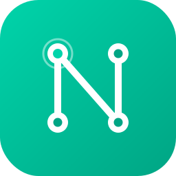

<div align="center">

> **⚠️ 警告：本项目正在积极开发中。**
> 请勿在生产环境中构建或运行。功能尚未完善，可能存在安全漏洞。
>
> 默认网络为 **Algorand Testnet**。你可以从
> [Algorand Testnet 水龙头](https://bank.testnet.algorand.network/)获取免费的测试 ALGO，
> 从 [Circle Testnet 水龙头](https://faucet.circle.com/)获取测试 USDC。

<br>



# OpenNodia

**你的节点。你的资产。你的市场。**

面向 Algorand 的开源自托管 DEX 节点。

[](LICENSE)
[](https://www.rust-lang.org/)
[](#路线图)
[](https://algorand.org/)

<br>

<a href="README.md">English</a> ·
<a href="README.ko.md">한국어</a> ·
<a href="README.zh.md"><b>中文</b></a> ·
<a href="README.ja.md">日本語</a>

<br><br>

</div>

---

## 概述

OpenNodia 让你**运行自己的 Algorand 节点**，用自己的账本副本验证 ASA 资产，并在你控制的自托管服务器上运营**非托管 DEX**。

没有中心化交易所，没有托管，没有第三方 API 来决定什么是"真实"。只有你的节点、你的资产、你的规则。

```
┌──────────────────────────────────────────────────────────────────┐
│                      你的 PC / NAS / VPS                         │
│                                                                  │
│   ┌──────────────┐         ┌──────────────────────────────────┐  │
│   │              │  读取   │       OpenNodia 守护进程          │  │
│   │   Algorand   │◄────────┤   ┌──────────┬───────────────┐   │  │
│   │    节点      │         │   │ Web UI   │  资产管理      │   │  │
│   │   (algod)    │────────►┤   ├──────────┼───────────────┤   │  │
│   │              │  事件   │   │ PIN 认证 │  DEX 引擎      │   │  │
│   └──────────────┘         │   ├──────────┼───────────────┤   │  │
│                            │   │ Connect  │  SQLite 缓存  │   │  │
│                            │   └──────────┴───────────────┘   │  │
│                            └───────────────┬──────────────────┘  │
└────────────────────────────────────────────┼─────────────────────┘
                                             │ HTTP / WebSocket
                          ┌──────────────────┼──────────────────┐
                          ▼                  ▼                  ▼
                    ┌──────────┐       ┌──────────┐       ┌──────────┐
                    │ 桌面     │       │ 移动     │       │ 平板     │
                    │ 浏览器   │       │ 浏览器   │       │ 浏览器   │
                    └──────────┘       └──────────┘       └──────────┘
```

## 为什么选择 OpenNodia？

大多数 Algorand 用户依赖托管浏览器和第三方 DEX。OpenNodia 颠覆了这一模式：

| | 传统方式 | OpenNodia |
|---|---|---|
| **账本来源** | 公共 API（限速、第三方） | 你自己的节点（本地、无限） |
| **资产托管** | 交易所持有你的密钥 | 非托管 — 你始终持有密钥 |
| **DEX** | 中心化撮合服务器 | 自托管原子交换，无中间人 |
| **信任** | "信任运营方" | "信任你自己的节点" |
| **隐私** | 账户数据发送到外部 API | 查询默认保持在本地 |

## 核心功能

- **本地优先账本** — 从你自己的 `algod` 节点读取。公共 API 只是回退方案，绝不是主要来源。
- **设计上非托管** — OpenNodia 绝不持有你的资产。每笔交易都需要你的明确签名。
- **自托管 DEX** — 通过原子交换交易 ASA。没有中心化撮合引擎，没有你无法控制的订单簿服务器。
- **钱包管理** — 创建或导入 Algorand 钱包（基于 kmd）。多钱包、地址生成、PIN 保护访问。
- **发送与接收** — 在签名前以人类可读的预览发送 ALGO 和 ASA。支持 ASA opt-in。
- **PIN 保护的 Web 访问** — 轻量级 Web 仪表板，受 PIN 保护（argon2id 哈希）。随时可更改。
- **地址验证消息** *(计划中)* — 使用 E2EE 进行一对一聊天，通过 Algorand 地址认证。无法冒充。
- **AI 助手** *(计划中)* — 一个帮助你使用 OpenNodia 的可选聊天机器人。连接你自己的 LLM，让它验证 ASA ID、解释资产或回答问题。它可以读取和解释，但永远无法签名交易或下达买卖订单。

## 核心原则

| 原则 | 含义 |
|---|---|
| **本地优先** | 由你自己的节点验证账本，而非公共 API。 |
| **非托管** | OpenNodia 永远不会持有你的资产。 |
| **自托管** | 你在自己的 PC、NAS 或 VPS 上运行守护进程。 |
| **开源** | 采用 Apache-2.0 许可证，完全透明。 |
| **人工批准** | 每笔交易都需要用户的明确批准。 |
| **仅现货资产** | 针对可自由转让的 ASA 进行原子交换。无衍生品。 |
| **AI 助手** | 连接你自己的 LLM 的可选聊天机器人。它可以读取和解释，但永远无法签名交易或下单。 |

## 组件

| 组件 | 说明 | 状态 |
|---|---|---|
| **OpenNodia Node** | Algorand 节点守护进程和账本连接器 | :white_check_mark: |
| **OpenNodia Assets** | ASA 资产管理终端（含策略分级） | :white_check_mark: |
| **OpenNodia DEX** | 非托管、自托管现货 DEX（原子交换） | :white_check_mark: |
| **OpenNodia Connect** | 地址验证的一对一 E2EE 消息 | :construction: |
| **OpenNodia Channels** | 单发布者公告频道 | :hourglass: |
| **OpenNodia Mobile** | 移动网页 / PWA 伴侣应用 | :hourglass: |

## 技术栈

| 层 | 技术 |
|---|---|
| **后端** | [Rust](https://www.rust-lang.org/)（edition 2021，MSRV 1.80） |
| **Web 框架** | [axum](https://github.com/tokio-rs/axum) + [tower-http](https://github.com/tower-rs/tower-http) |
| **区块链** | [Algorand](https://algorand.org/)（algod + kmd REST API） |
| **智能合约** | TEAL v8 LogicSig（由 algod 从源码编译） |
| **数据库** | SQLite（[rusqlite](https://github.com/rusqlite/rusqlite)）— 本地订单簿和缓存 |
| **前端** | [Svelte](https://svelte.dev/) + [Vite](https://vitejs.dev/) + [Tailwind CSS](https://tailwindcss.com/) |
| **认证** | argon2id（PIN）+ HMAC 会话令牌 |
| **架构** | Cargo workspace 单体仓库 |
| **许可证** | Apache-2.0 |

## 仓库结构

```
opennodia/
├── crates/
│   ├── opennodia-core/      # 共享类型：Address, AssetId, MicroAlgo, Round
│   ├── opennodia-node/      # algod/kmd REST 客户端、节点状态、账户/资产查询
│   ├── opennodia-assets/    # ASA 管理、策略分级（open/bridged/regulated）
│   ├── opennodia-swap/      # 原子交换：托管、交易构建器、撮合引擎
│   ├── opennodia-dex/       # 本地订单簿：SQLite 持久化、链上事件跟踪
│   └── opennodia-server/    # HTTP 服务器、Web UI、PIN 认证、钱包管理、DEX API
├── frontend/                # Svelte SPA（多语言：EN/KO/ZH/JA）
├── docker/                  # algod 容器 entrypoint 包装器
├── Cargo.toml               # 工作区根目录
├── docker-compose.yml       # 节点、有界 Indexer、PostgreSQL 和辅助服务
├── Dockerfile               # 多阶段构建（前端 + 后端）
└── LICENSE                  # Apache-2.0
```

## 路线图

| 里程碑 | 标题 | 状态 |
|---|---|:---:|
| **M0** | 单体仓库脚手架 | :white_check_mark: |
| **M1** | 节点与 Web 服务器基础 | :white_check_mark: |
| **M2** | 资产仪表板 | :white_check_mark: |
| **M3** | 原子交换核心 | :white_check_mark: |
| **M4** | 本地订单簿 DEX | :white_check_mark: |
| **M5** | 社区 DEX | :construction: |
| **M6** | Connect：验证 DM | :hourglass: |
| **M7** | 公告频道 | :hourglass: |
| **M8** | 本地 Indexer | :white_check_mark: |
| **M9** | AI 代理桥接 | :hourglass: |
| **M10** | 移动 Web 与 PWA | :hourglass: |
| **M11** | 公开发布 (v1.0) | :hourglass: |

## 硬件要求

OpenNodia 运行一个参与节点、一个轻量级跟随者节点、Conduit 管道、PostgreSQL
和一个只读索引器 API。以下是自托管部署的推荐配置。

### 推荐配置

| 资源 | Testnet | Mainnet |
|------|---------|---------|
| **CPU** | 4 核 | 8 核 |
| **内存** | 8 GB | 16 GB |
| **磁盘** | 100 GB SSD | 200 GB 可用 SSD（建议 256 GB 设备） |
| **网络** | 10 Mbps | 50 Mbps+ |

### 注意事项

- **两个 algod 节点。** 参与节点赚取区块奖励并中继交易；跟随者节点是
  Conduit 的轻量级 non-archival 数据源，默认仅保留 2,000 轮 account delta。
- **磁盘类型很重要。** 强烈建议使用 SSD（或 NVMe）。机械硬盘会让 algod 追赶和
  索引器引导变得非常缓慢。
- **有界本地 Indexer。** 默认仅保留最近 20,000 轮，并同时修剪 transaction、
  participation 和 block header。注册钱包的交易保存在独立 PostgreSQL schema，
  其他旧记录使用 public Indexer。
- **Mainnet 容量预算。** 包含参与节点、跟随者、有界 PostgreSQL 与容器开销，
  一般预计约 120–180 GB。交易所级别高频钱包的永久缓存可能超过此估算。
- **不影响区块奖励。** 参与节点与跟随者节点和 Conduit 管道完全独立。持有
  30,000+ ALGO 且有效参与密钥保持在线的节点，无论跟随者或索引器是否运行，
  都会继续提议区块并获得奖励。

## 快速开始

> **OpenNodia 正在积极开发中。** 核心功能（节点连接器、资产仪表板、
钱包管理、发送/接收、本地 DEX）已在 Algorand Testnet 上可用。使用 Docker
Compose 可以最快开始。

### 方式 A：Docker Compose（推荐）

```bash
# 克隆仓库
git clone https://github.com/AbaloneLabs/OpenNodia.git
cd OpenNodia

# 复制示例配置
cp opennodia.sample.toml opennodia.toml

# 在仓库外生成每次安装独有的 secret
./scripts/init-secrets.sh
# Windows PowerShell：
# powershell -ExecutionPolicy Bypass -File .\scripts\init-secrets.ps1

# 启动完整栈：
#   algod（参与节点）+ algod-follower + conduit + postgres + indexer + opennodia
docker compose up -d

# 使用初始化脚本输出的地址打开 Web UI
# 示例：http://192.168.1.20:30080
```

初始化脚本会检测默认路由使用的私有 IPv4，并只在该主机接口上发布 Web UI。
这样同一局域网中的设备可以访问，同时不会像 `0.0.0.0` 那样暴露所有接口。
若只允许本机访问，请在初始化前设置
`OPENNODIA_BIND_ADDRESS=127.0.0.1`；若要覆盖自动检测，请指定目标接口的
IP。来自路由网络的最终可达范围仍由主机和网络防火墙规则决定。

`init-secrets.sh` 会在
`${XDG_CONFIG_HOME:-$HOME/.config}/opennodia/secrets` 下创建权限受限且每次
安装唯一的凭据。`.env` 只保存普通设置和 secret 目录的绝对路径。Docker
通过只读 secret 文件接收凭据，因此常规 Compose 渲染、容器检查和 Git 操作
不会输出实际值。重复运行初始化脚本或重启主机、Docker、容器时都会复用现有
文件，不会生成新凭据；已明确设置的 `OPENNODIA_BIND_ADDRESS` 也会保留。
安全边界和代理协作规则请参阅
[SECURITY.md](SECURITY.md)。

首次打开 UI 时，你将设置一个 PIN。然后可以创建或导入 Algorand 钱包开始使用。

该堆栈还包含轻量级 Indexer bootstrap 和 pruning 辅助服务：

| 服务 | 角色 |
|------|------|
| `algod` | 参与节点 — 共识、区块奖励、kmd、交易中继 |
| `algod-follower` | 轻量级跟随者节点 — 向 Conduit 流式传输区块数据 |
| `conduit` | 数据管道 — 从跟随者读取区块写入 PostgreSQL |
| `postgres` | 数据库 — 存储索引的区块链数据 |
| `indexer` | 只读 REST API — 提供资产搜索和交易历史 |
| `indexer-bootstrap` | 在 follower 最新位置附近执行一次初始化 |
| `indexer-pruner` | 将本地 Indexer 限制为最近 20,000 轮 |
| `opennodia` | OpenNodia 服务器 + Web UI |

参与节点与跟随者/Conduit/indexer 管道完全独立，因此**不影响**区块奖励或节点共识。
在本地索引器引导期间，OpenNodia 会自动回退到公共索引器中继，使搜索和历史记录
立即可用。

### 方式 B：从源码构建

```bash
# 后端（需要 Rust 1.88+）
cargo build --workspace
cargo run --bin opennodia-server -- --config opennodia.toml

# 前端（单独终端）
cd frontend
npm install
npm run dev    # http://localhost:5173（将 /api 代理到 :30080）
```

### 运行测试

```bash
# 所有 Rust 测试（离线 — 无需 algod）
cargo test --workspace
```

## 不在范围内

- 托管用户资产
- 投资建议
- 自动/算法交易
- 杠杆、保证金、期货或衍生品
- 证券交易所
- 群聊
- AI 驱动的交易、下单或交易签名
- AI 发起的买卖操作

## 贡献

本项目正在积极开发中。目前暂不接受 Pull Request，但欢迎：

- :beetle: **Bug 报告** — 提交 [issue](https://github.com/AbaloneLabs/OpenNodia/issues)
- :brain: **AI 辅助分析** — 欢迎使用 AI 工具识别安全漏洞、代码异味或改进机会的 issue。请清晰描述发现的内容。
- :bulb: **想法和反馈** — 发起 [discussion](https://github.com/AbaloneLabs/OpenNodia/discussions)
- :globe_with_meridians: **翻译** — 帮助改进多语言 README

## 许可证

根据 [Apache License, Version 2.0](LICENSE) 获得许可。

<div align="center">
<sub>使用 Rust 为 Algorand 生态系统构建。</sub>
</div>
